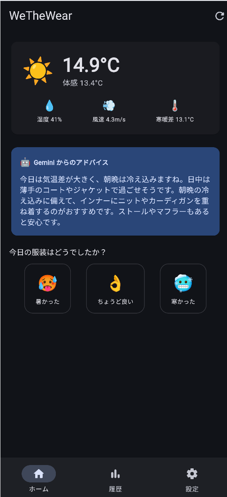
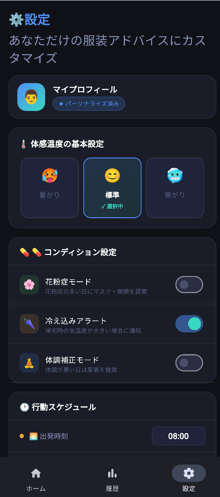
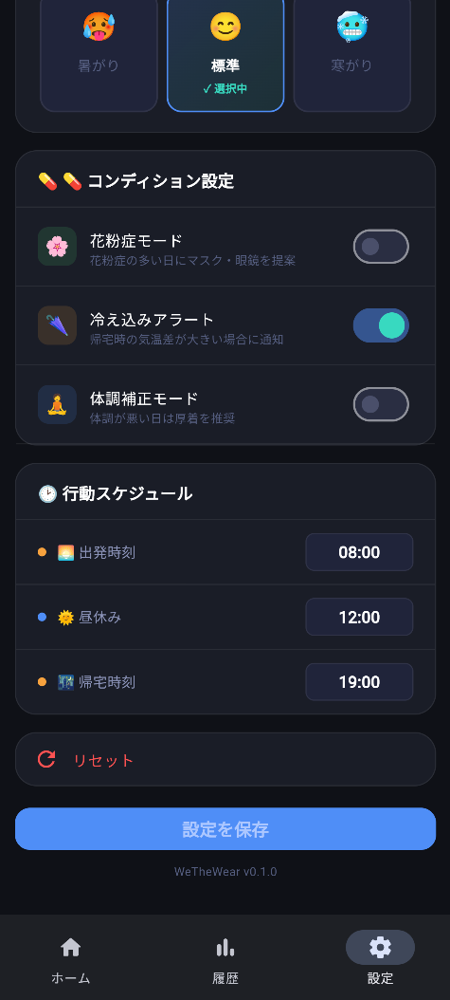

# WeTheWear 🌤️👕
## あなた専用のパーソナル服装提案アプリ

「今日、何着れば後悔しない？」を解決する、
使えば使うほど進化するパーソナライズ型服装アドバイザー。

---

## 🎯 アプリのコンセプト

一般的な天気予報の服装基準ではなく、**あなた自身の体感（暑がり・寒がり）** と **過去のフィードバック** に合わせた服装を提案します。

**考慮するデータ**
- **気象データ**: 気温、体感温度、湿度、風速、天気など
- **ユーザー設定**: 暑がり・標準・寒がり、花粉症の有無
- **タイムコンテキスト**: 1日の寒暖差、出発・昼・帰宅の推移

**テクノロジー**
- 🤖 **Gemini API** による高度な服装提案ロジック
- 📱 **Flutter** × **Riverpod** によるモダンなUI/UX
- ☁️ **Weather API** による正確な気象情報取得

---

## 👥 誰のためのアプリ？（ターゲットペルソナ）

| ユーザータイプ | 抱えている課題 | WeTheWearでの解決 |
|---|---|---|
| **🔥 暑がりさん** | 世間の基準は暑すぎる。薄着しすぎも嫌。 | 標準より薄着で「ちょうどいい」コーデを。 |
| **❄️ 寒がりさん** | 「今日は暖かい」予報を信じて夕方に凍える。 | 夕方の冷え込みや寒暖差を考慮した重ね着を。 |
| **🤔 標準さん** | 朝寒く昼暑いなど、1日を通した対応が難しい。 | 1日の寒暖差を見越したコーディネート予測。 |

---

## 📱 一目でわかる服装提案（メイン機能）

### 今日着るべき服を瞬時に
アプリを開いた瞬間に、現在地と時間、最新の天気情報から生成された最適なアドバイスが表示されます。

- **時間軸リスト**: 🕒 出発・昼・帰宅
- **賢いアラート**: ⚠️ 寒暖差が大きい日には警告
- **AI生成**: ✨ Gemini APIが体質に合わせたアドバイスを自動作成

---

## ⚙️ 自分だけのカスタマイズ（設定・初期登録）

### 自分の感覚を保存
最初の起動時や設定画面から、自分の「体質」をしっかり登録。

- **体質設定**: 暑がり・標準・寒がり
- **花粉症モード**: 花粉対策を含めたアドバイス
- ※季節の変わり目に合わせていつでも変更可能で、次回の予測に即座に反映されます。

---

## 📝 使えば使うほど賢く（履歴・フィードバック）

### 過去の記録からの学習
提案された服装に対しての感想を残し、過去の履歴として振り返ることができます。

- 🌡️ 「暑かった」「寒かった」の評価記録
- 🔄 **AI学習への活用**（使えば使うほどあなた専用に）
- 📅 まったく同じ天候の日に迷わないための振り返り機能

---

## 🏗️ システムアーキテクチャ

WeTheWearの堅牢な基盤と将来の拡張性

**4層アーキテクチャ**
1. **Data層**: `gemini_api_client`, `weather_api_client`, local storage
2. **Repository層**: `weather_repository`, `user_repository` などの抽象化
3. **ViewModel層**: `Riverpod` / `Freezed` による状態管理
4. **UI層**: Flutterの宣言的UI（`home_view` 等）

💡 **将来の展望**: 自分のクローゼットの服を画像つきで提案する機能や、ヘルスケア連携（体温・心拍数から体調予測）も視野に入れています🚀

---

## 🎉 まとめ

> **「今日、何着れば後悔しない？」**
> WeTheWear は、その悩みをテクノロジーとパーソナライズの力で解決します。

アプリを見るだけで、自分の感覚を信頼した服選びができる、
最高のユーザー体験とストレスフリーな朝を提供します。

### Thank You!
